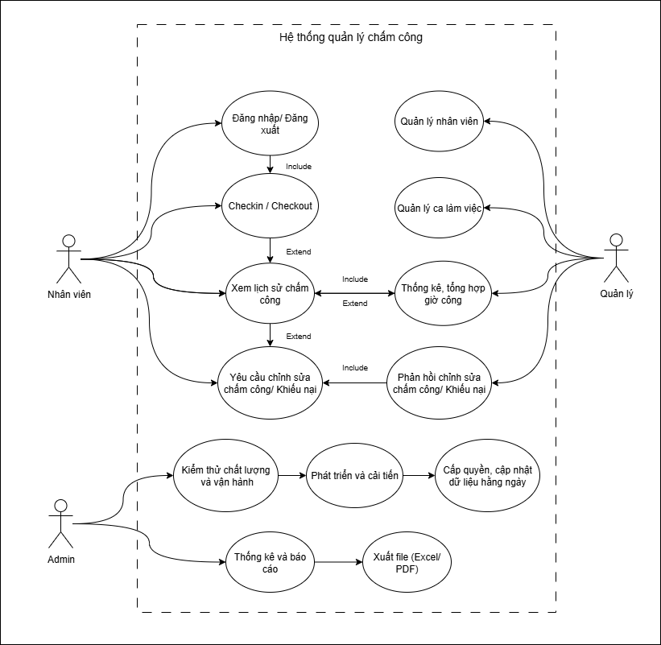

# Project Report
## 1. Giới thiệu
- Nội dung báo cáo này bao gồm các artifacts và mô tả quy trình làm việc khi xây dựng chức năng của hệ thống chấm công nhân viên.
- Trình bày các artifacts gồm: Use Case, Sequence Diagram, Form Login code (với JS, HTML và CSS)
## 2. Phân tích mục tiêu hệ thống
Hệ thống được lựa chọn là **Hệ thống chấm công nhân viên**.  
Mục tiêu chính: hỗ trợ nhân viên chấm công (checkin/checkout), quản lý theo dõi giờ làm, và cung cấp báo cáo cho quản lý.  
Xác định nhu cầu cơ bản: minh bạch giờ làm, dễ dàng theo dõi và giảm sai sót trong tính công.
## 3. Phân tích chức năng quan trọng
- **Checkin/Checkout**: nhân viên chấm công vào/ra.  
- **Yêu cầu chỉnh sửa giờ công/Khiếu nại**: nhân viên gửi khi phát hiện sai lệch.  
- **Thống kê, tổng hợp giờ công**: quản lý xem báo cáo theo ngày/tuần/tháng.  
## 4. Phân tích cách hệ thống hoạt động
Từ các chức năng trên, nhóm phân tích luồng hoạt động giữa **nhân viên – hệ thống – quản lý**.  
Mỗi chức năng được mô tả và trực quan hóa bằng sơ đồ UML (Use Case Diagram, Sequence Diagram).  
## 5. Quản lý và phát triển với GitHub
### Sau khi có bản phân tích và UML, nhóm bắt đầu làm quen với GitHub
- **Tạo repo public**:  
  Link repo: [https://github.com/Lanne-0402/Nhap-mon-CNPM.git](https://github.com/Lanne-0402/Nhap-mon-CNPM.git)  
Note: Một bạn trong nhóm sẽ tạo repository public và mời các thành viên tham gia để làm bài nhóm qua link trên. Người sở hữu repo (owner) trao quyền cho tất cả thành viên đều có thể chỉnh sửa để cùng nhau làm bài.
- **Sơ đồ UML Use Case Diagram (UC) cho các chức năng chính của hệ thống**:

- **Sơ đồ UML Use Case Diagram (UC) cho các chức năng checkin**:

- **Sơ đồ UML Sequence Diagram (SQ)**:

### Clone về máy cục bộ để làm Login Form:
```bash
git clone https://github.com/Lanne-0402/Nhap-mon-CNPM.git
cd Nhap-mon-CNPM
```
- Login Form:

5. Triển khai demo bằng GitHub Pages

Nhóm sử dụng GitHub Pages để deploy trực tiếp giao diện từ branch main.
Bật GitHub Pages trong Settings → Pages.
Link demo: https://lanne-0402.github.io/Nhap-mon-CNPM/
