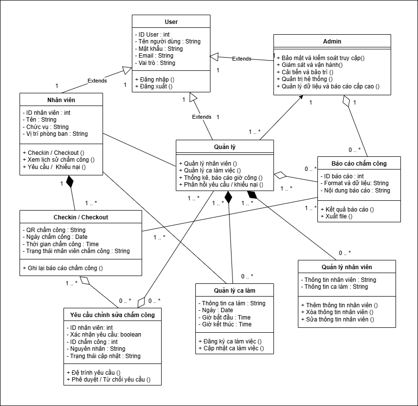
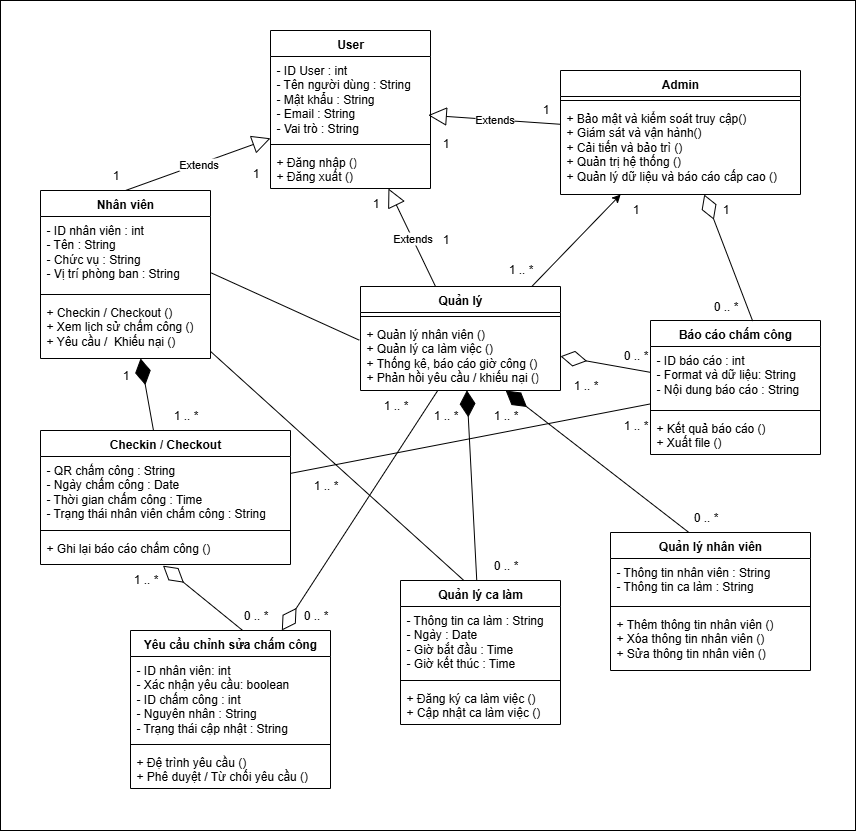
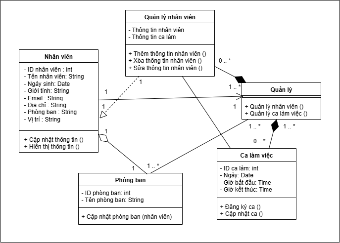
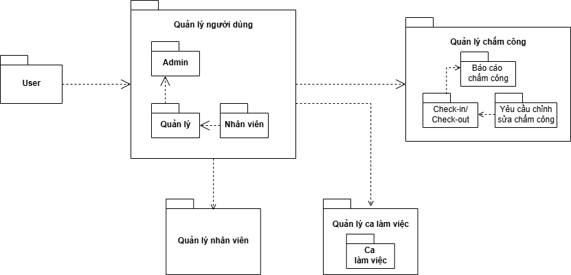
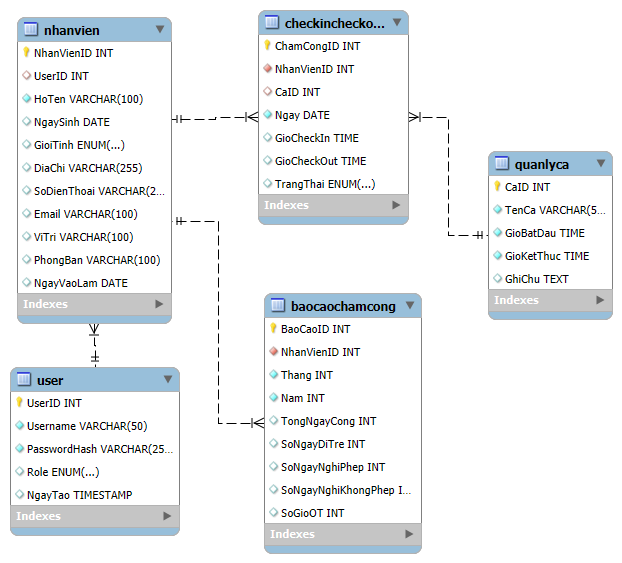
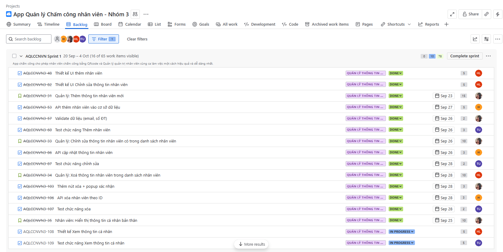
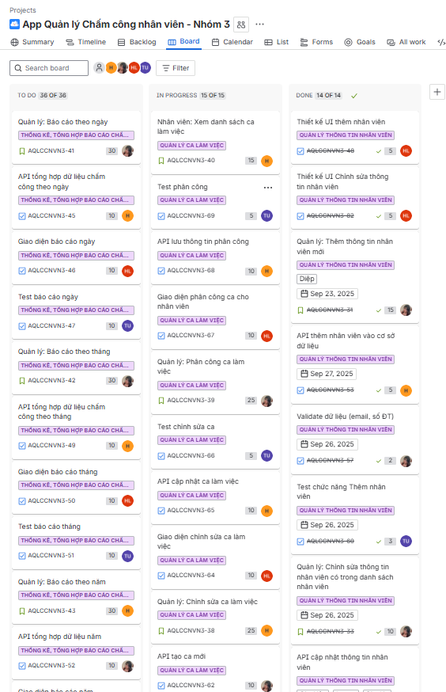
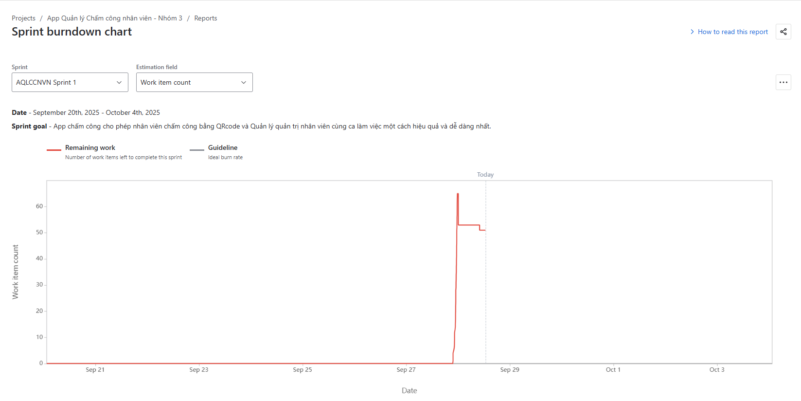

# 🕒 Mini App Quản Lý Chấm Công

## 1. Giới thiệu
Mini App Quản Lý Chấm Công được xây dựng từ các Lab trước, với mục tiêu:
- Quản lý tài khoản người dùng (nhân viên, quản lý).
- Hỗ trợ chấm công, đăng nhập/đăng xuất ca làm.
- Lưu trữ dữ liệu trên cơ sở dữ liệu quan hệ.
- Cung cấp giao diện web đơn giản, dễ sử dụng.
- Đảm bảo tính chính xác và bảo mật thông tin.
---
## 2. Mô hình UML
#### Mô hình Use Case App chấm công:

#### Mô hình Use Case chức năng Quản lý thông tin nhân viên:

#### Mô hình Sequence chức năng Quản lý thông tin nhân viên:

#### Class Diagram App Chấm công:

#### Class Diagram chức năng Quản lý thông tin nhân viên:

#### Package Diagram App Chấm công:

#### Package Diagram chức năng Quản lý thông tin nhân viên:

---
## 3. Thiết kế database

### Các bảng chính

- User – Quản lý tài khoản đăng nhập (Admin, Manager, Employee).
- NhanVien – Thông tin nhân sự (họ tên, ngày sinh, vị trí, phòng ban...).
- QuanLyCa – Danh sách ca làm việc (tên ca, giờ bắt đầu/kết thúc).
- CheckInCheckOut – Ghi nhận giờ vào/ra của nhân viên.
- BaoCaoChamCong – Tổng hợp báo cáo theo tháng/năm (số ngày công, đi trễ, nghỉ, OT).

### Quan hệ giữa các bảng

- User – NhanVien: 1-1 (mỗi tài khoản gắn với một nhân viên).
- NhanVien – CheckInCheckOut: 1-nhiều (một nhân viên có nhiều lần chấm công).
- QuanLyCa – CheckInCheckOut: 1-nhiều (một ca có nhiều bản ghi chấm công).
- NhanVien – BaoCaoChamCong: 1-nhiều (một nhân viên có nhiều báo cáo theo tháng/năm).

---
## 4. Kết quả test & sprint report 

### A. Kết quả Test Login
#### ✅ Login thành công (`test_login_success`)
- Nhập đúng username/password (ví dụ: `nv001` / `123456`).
- Bấm **Login**.
- Kiểm tra hiển thị thông báo:  
  `"Đăng nhập thành công! (demo)"`.

#### ❌ Login sai (`test_login_fail`)
- Nhập đúng username nhưng password sai.
- Bấm **Login**.
- Kiểm tra hiển thị:  
  `"Sai username hoặc password."`.

#### 🧹 Cancel xoá form (`test_cancel_clears_form`)
- Nhập username/password.
- Bấm **Cancel**.
- Form phải reset về rỗng + có thông báo:  
  `"Đã xóa dữ liệu nhập."`.

#### 💾 Remember me lưu LocalStorage (`test_remember_me_localstorage`)
- Nhập username + tick **Remember me**.
- **Login** → refresh trang.
- Username vẫn được tự động điền lại từ LocalStorage.

#### 👁 Toggle hiển thị mật khẩu (`test_toggle_password_visibility`)
- Nhập mật khẩu.
- Bấm nút 👁 (toggle).

### B. Unit Test Module

### Lý do viết mock code
- **An toàn dữ liệu**: Tránh việc test làm thay đổi hoặc xóa nhầm dữ liệu thật trong database chính.  
- **Bảo vệ code gốc**: Testing trên code chính có thể gây ra lỗi ngoài ý muốn. Việc tách mock code giúp giữ cho code production ổn định.  
- **Tiện lợi khi kiểm thử**: Không cần kết nối đến MySQL, có thể chạy test nhanh chóng ở bất kỳ môi trường nào.  
- **Dễ dàng reset**: Có thể khởi tạo lại mock database bất cứ lúc nào để chạy lại test từ đầu.  

---

### Phương pháp thực hiện

#### Mock code
- **CSDL giả lập (mock_db)**: sử dụng một `list` Python để lưu trữ dữ liệu nhân viên thay cho bảng thật.  
- **Các hàm kiểm tra dữ liệu nhập**:  
  - `nhap_chuoi()` → chỉ cho phép chữ cái và khoảng trắng.  
  - `nhap_ngay()` → yêu cầu định dạng `YYYY-MM-DD`, không cho phép ngày trong tương lai.  
  - `nhap_email()` → kiểm tra định dạng email.  
  - `nhap_sdt()` → chỉ cho phép số, độ dài từ 9–15 ký tự.  
- **Các hàm CRUD**:  
  - `them_nhan_vien()` → thêm nhân viên mới.  
  - `xem_danh_sach()` → xem danh sách nhân viên.  
  - `cap_nhat_nhan_vien()` → cập nhật thông tin.  
  - `xoa_nhan_vien()` → xóa nhân viên.  
- **Hàm hỗ trợ**: `reset_db()` để khởi tạo lại dữ liệu khi chạy nhiều lần test.  

#### Pytest
- Sử dụng `pytest` để tự động chạy test case.  
- Dùng **fixture `reset_data`** để làm mới dữ liệu trước và sau mỗi test.  
- Test bao gồm nhiều trường hợp (thành công và thất bại).  

---

### Các trường hợp test tiêu biểu

#### CRUD
- **Thêm nhân viên hợp lệ** → dữ liệu được thêm vào mock_db.  
- **Thêm nhân viên thiếu tên** → `ValueError`.  
- **Cập nhật địa chỉ hợp lệ** → thông tin thay đổi thành công.  
- **Cập nhật nhân viên không tồn tại** → `ValueError`.  
- **Cập nhật field không hợp lệ** → `ValueError`.  
- **Cập nhật giá trị rỗng** → `ValueError`.  
- **Xóa nhân viên hợp lệ** → nhân viên bị xóa khỏi danh sách.  
- **Xóa nhân viên không tồn tại** → `ValueError`.  

#### Kiểm tra dữ liệu nhập
- **Ngày hợp lệ**: `"2020-12-31"` → hợp lệ.  
- **Ngày sai định dạng**: `"2020/12/31"` → `ValueError`.  
- **Ngày tương lai**: `"2100-01-01"` → `ValueError`.  
- **Email hợp lệ**: `"test@gmail.com"`.  
- **Email sai**: thiếu `@`, thiếu domain, chuỗi rỗng → `ValueError`.  
- **Số điện thoại hợp lệ**: `"0912345678"`.  
- **Số điện thoại sai**: chứa chữ, quá ngắn/dài, ký tự đặc biệt → `ValueError`.  
- **Chuỗi hợp lệ**: `"Nguyen Van A"`, `"   Le Diep   "` → được trim khoảng trắng.  
- **Chuỗi sai**: rỗng, toàn khoảng trắng, chứa số/ký tự đặc biệt → `ValueError`.  

---

### Kết quả
- Toàn bộ test được chạy tự động bằng `pytest`.  
- Các chức năng CRUD và validation đều được kiểm tra.  
- Các trường hợp nhập sai dữ liệu đều sinh lỗi đúng như mong đợi.

### C. Sprint report
- Sprint 1 (2 tuần): Hoàn thành chức năng Quản lý thông tin cá nhân của nhân viên
-	Sprint Goal: App chấm công cho phép nhân viên chấm công bằng QR code và Quản lý quản trị nhân viên cùng ca làm việc một cách hiệu quả và dễ dàng nhất.
#### Backlog App cho chức năng Quản lý thông tin nhân viên trong Sprint 1:

#### Board App cho chức năng Quản lý thông tin nhân viên trong Sprint 1:

#### BurnDown Chart cho chức năng Quản lý thông tin nhân viên trong Sprint 1:

---
## 5. Kết luận & định hướng mở rộng 
**Kết luận:**
Mini App chấm công nhân viên đã được xây dựng và triển khai với các chức năng cơ bản như: quản lý thông tin nhân viên, ghi nhận giờ vào/ra, quản lý ca làm việc, xuất báo cáo chấm công theo ngày/tháng/năm. Ứng dụng giúp giảm thiểu sai sót trong việc quản lý thời gian làm việc, đồng thời hỗ trợ bộ phận nhân sự theo dõi dữ liệu một cách trực quan, nhanh chóng và chính xác. Qua quá trình phát triển, nhóm đã áp dụng UML để phân tích hệ thống, xây dựng cơ sở dữ liệu, viết code minh họa, kiểm thử và tổng hợp sprint report nhằm đảm bảo tiến độ và chất lượng sản phẩm.

**Định hướng mở rộng:**
- Bổ sung tính năng phân quyền (Admin, Nhân viên, Quản lý).
- Tích hợp tính năng chấm công bằng GPS hoặc nhận diện khuôn mặt để tăng độ tin cậy.
- Xuất báo cáo đa dạng hơn (PDF, Excel) và cho phép thống kê nâng cao (tăng ca, nghỉ phép).
- Kết nối với hệ thống tính lương để tự động hóa quy trình nhân sự.
- Tối ưu giao diện người dùng trên cả web và mobile nhằm nâng cao trải nghiệm sử dụng.
